# Library_Management_System

# 📚 Library Management System

A modern and user-friendly **Library Management System** built using **Python, Streamlit, SQLite, Pandas, and Plotly**. This application enables librarians to efficiently manage books, members, transactions, and reports while providing students with a secure portal to browse and borrow books.

---

## 🚀 Live Demo
https://librarymanagementsystem-v.streamlit.app/


-------
## Login Access
For Admin Login :
username : admin,
password : admin123
For Student Login: 
First Register and Next Login With Given Credientials


## ✨ Features

### 👨‍💼 Admin Panel

- Secure Admin Login
- Dashboard with real-time statistics
- Add, View, Search, Update, and Delete Books
- Manage Library Members
- Issue and Return Books
- Transaction Management
- Library Reports
- Overdue Books Report
- Export Reports as CSV
- Application Settings

---

### 🎓 Student Portal

- Student Registration
- Secure Student Login
- Browse Available Books
- Search Books
- Borrow Books
- View Issued Books
- View Personal Profile
- Logout

---

### 📊 Dashboard

- Total Books
- Available Books
- Total Members
- Issued Books
- Overdue Books
- Interactive Charts using Plotly
- Recent Transactions

---

### 📚 Book Management

- Add New Books
- View All Books
- Search by Title, Author, Category, or ISBN
- Update Book Details
- Delete Books
- Automatic ISBN Validation

---

### 👥 Member Management

- Add Members
- View Members
- Search Members
- Update Member Information
- Delete Members

---

### 🔄 Transaction Management

- Issue Books
- Return Books
- Track Issue Date
- Track Due Date
- Transaction History

---

### 📈 Reports

- Library Summary
- Overdue Books Report
- Transaction Report
- CSV Export

---

### 🔐 Authentication

- Role-Based Login
- Admin Authentication
- Student Registration
- Student Login
- Password Hashing using SHA-256

---

## 🛠️ Technologies Used

| Technology | Purpose |
|------------|---------|
| Python | Backend Development |
| Streamlit | Web Application Framework |
| SQLite | Database |
| Pandas | Data Processing |
| Plotly | Interactive Charts |
| HTML & CSS | UI Styling |
| SHA-256 | Password Hashing |

---

## 📂 Project Structure

```text
LibraryManagementSystem/
│
├── app.py
├── database.py
├── auth.py
├── dashboard.py
├── book.py
├── member.py
├── transaction.py
├── reports.py
├── student.py
│
├── assets/
│   └── logo.png
│
├── screenshots/
│   ├── dashboard.png
│   ├── books.png
│   ├── members.png
│   ├── transactions.png
│   ├── reports.png
│   └── login.png
│
├── library.db
├── requirements.txt
└── README.md
```

---


## 📸 Application Screenshots

### 🔐 Login Page
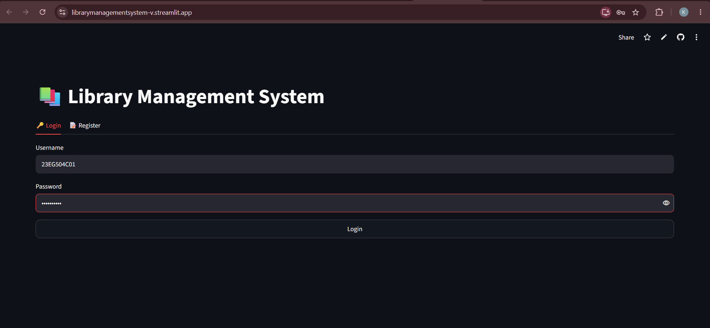

### 📝 Register Page
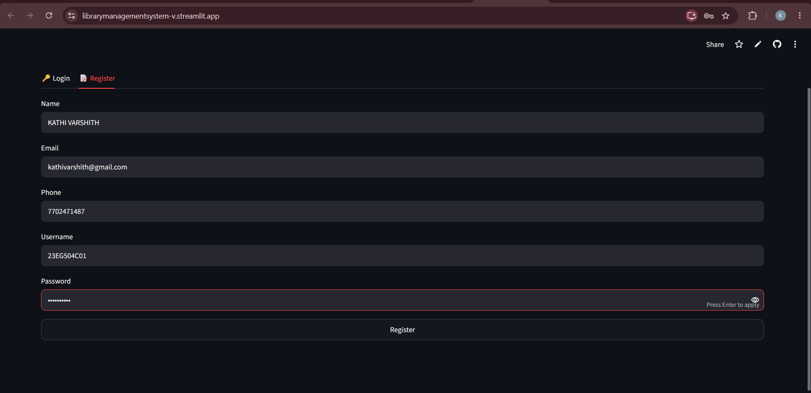

### 📊 Admin Dashboard
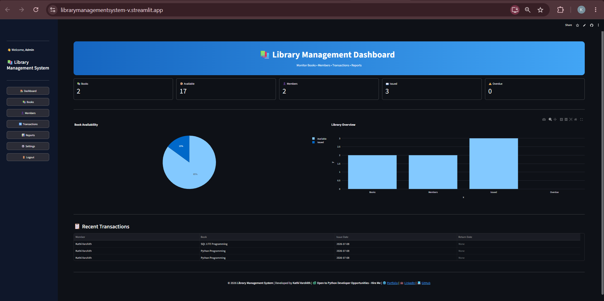

### 📚 Book Management
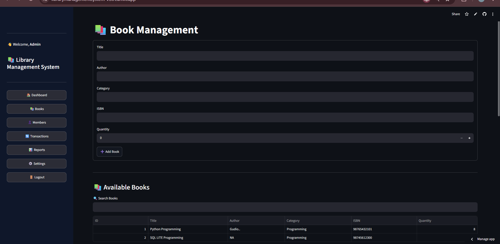

### ✏️ Update & Delete Books
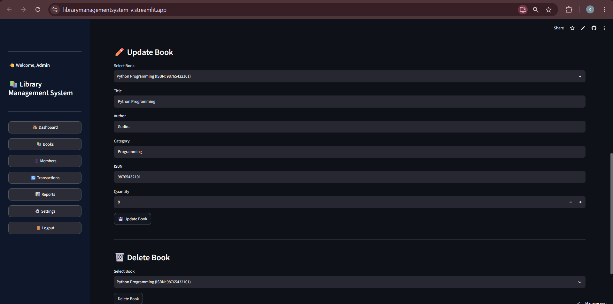

### 👥 Member Management
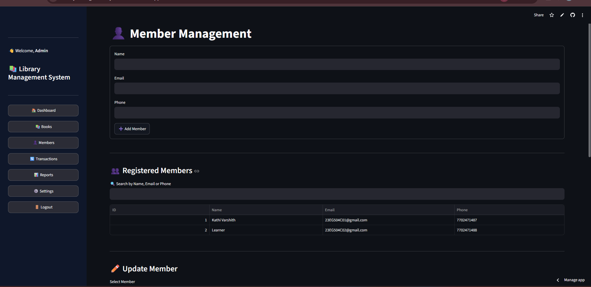

### ✏️ Update & Delete Members
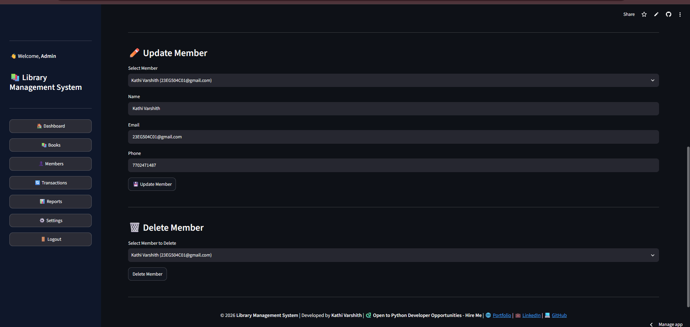

### 🔄 Transactions
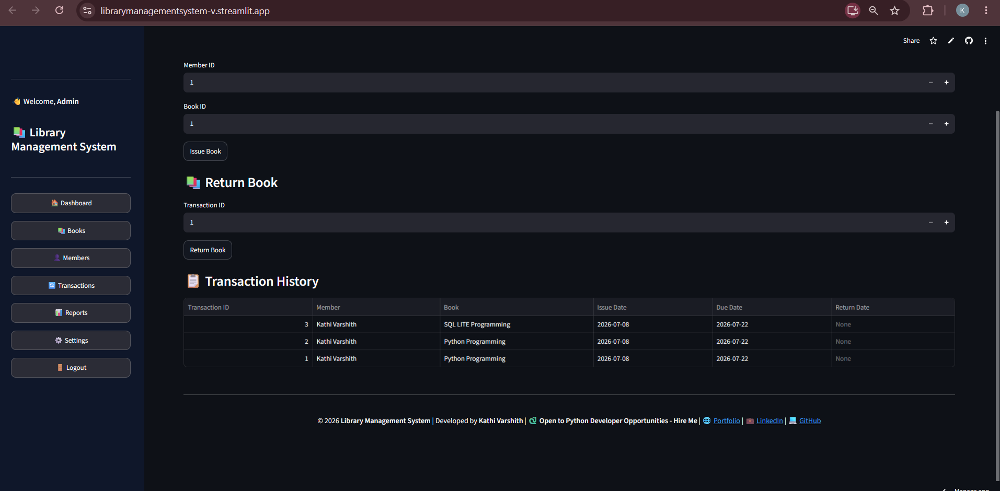

### 📈 Reports
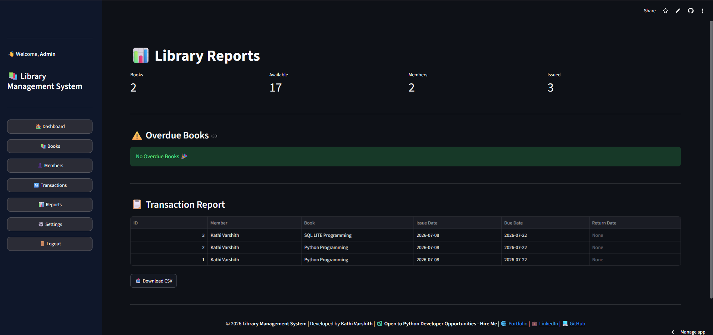

### ⚙️ Settings
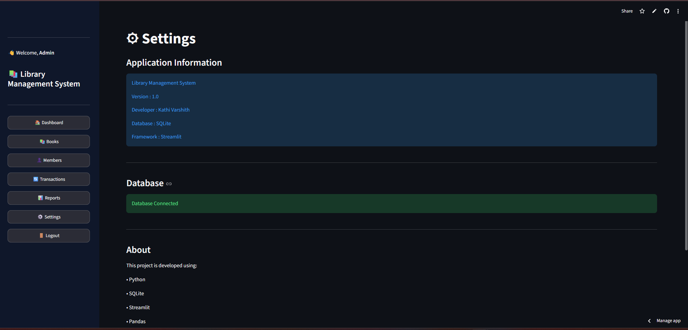

### 📚 Student - Available Books
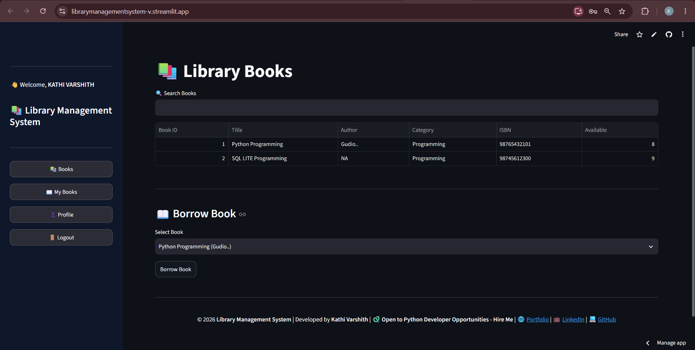

### 📖 Student - My Issued Books
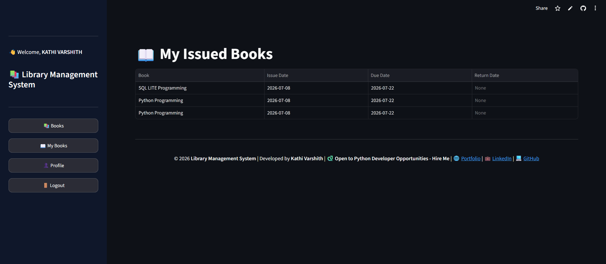

### 👤 Student Profile
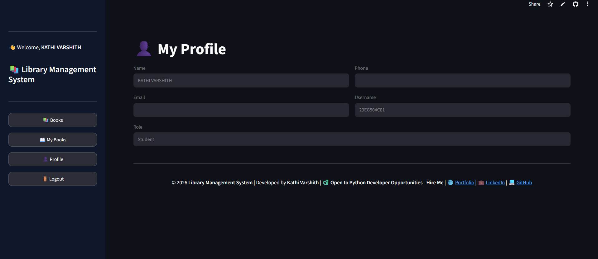

### 📊 Student Dashboard


## ⚙️ Installation

### 1️⃣ Clone the Repository

```bash
git clone https://github.com/Kathivarshith/LibraryManagementSystem.git
```

### 2️⃣ Navigate to the Project Folder

```bash
cd LibraryManagementSystem
```

### 3️⃣ Create a Virtual Environment

```bash
python -m venv venv
```

### 4️⃣ Activate the Virtual Environment

**Windows**

```bash
venv\Scripts\activate
```

**Linux / macOS**

```bash
source venv/bin/activate
```

### 5️⃣ Install Dependencies

```bash
pip install -r requirements.txt
```

### 6️⃣ Run the Application

```bash
streamlit run app.py
```

---

## 📦 Requirements

```text
streamlit
pandas
plotly
```

or generate automatically using:

```bash
pip freeze > requirements.txt
```

---

## 🔒 Default Admin Credentials

> Create the admin account before logging in.

**Username**

```text
admin
```

**Password**

```text
admin123
```

---

## 📈 Future Enhancements

- Fine Management System
- Email Notifications
- QR/Barcode Scanner Integration
- Book Reservation System
- PDF Report Export
- Dark/Light Theme Toggle
- Multi-Admin Support
- Book Cover Image Upload
- Notification System
- Cloud Database Integration

---

## 💻 Developer

**Kathi Varshith**

🐍 Open to Python Developer Opportunities

### 🌐 Portfolio

https://varshithkathi.netlify.app/

### 💼 LinkedIn

https://www.linkedin.com/in/kathi-varshith/

### 💻 GitHub

https://github.com/Kathivarshith

📧 Email

kathivarshith14@gmail.com

---

## ⭐ Support

If you found this project helpful:

⭐ Star the repository

🍴 Fork the project

📢 Share your feedback

---

## 📄 License

This project is developed for educational and portfolio purposes.

---

<div align="center">

### 📚 Library Management System

Developed with ❤️ by **Kathi Varshith**

🐍 **Open to Python Developer Opportunities | Hire Me**

© 2026 All Rights Reserved.

</div>
